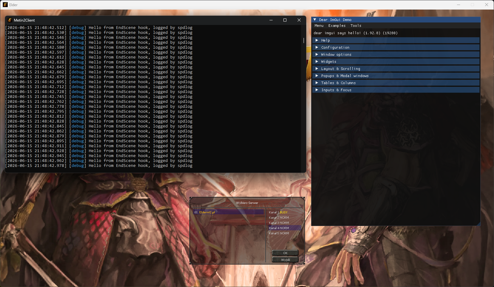
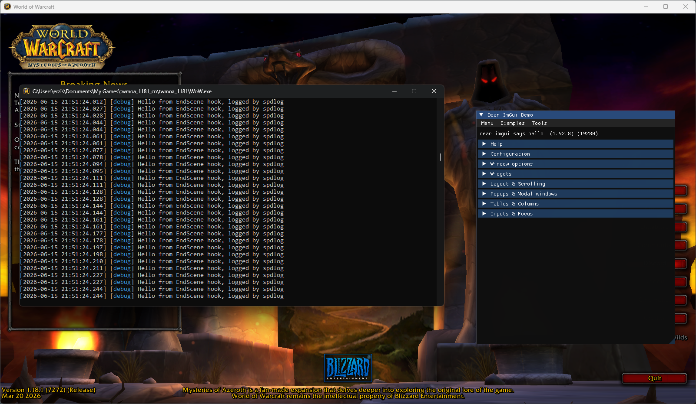

# DirectX 9 x86 EndScene hook
Allows to draw an ImGui menu after injecting and interact with it. The project also includes spdlog library for logging.
MS Detours was used for hooking.

## Keybinds
INSERT = toggle menu  
END = unload DLL

## Showcase

